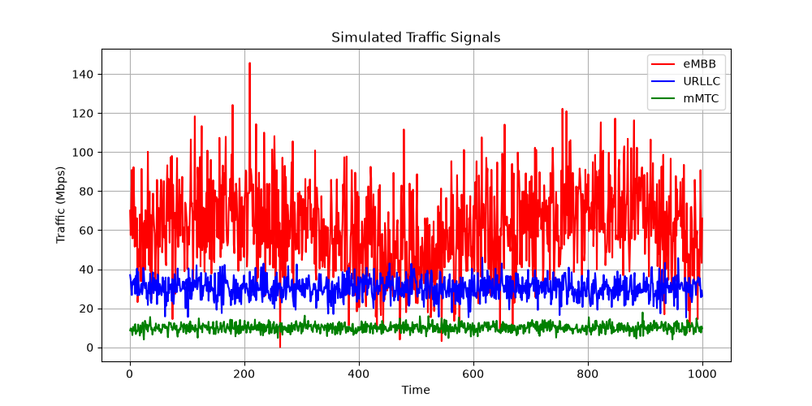
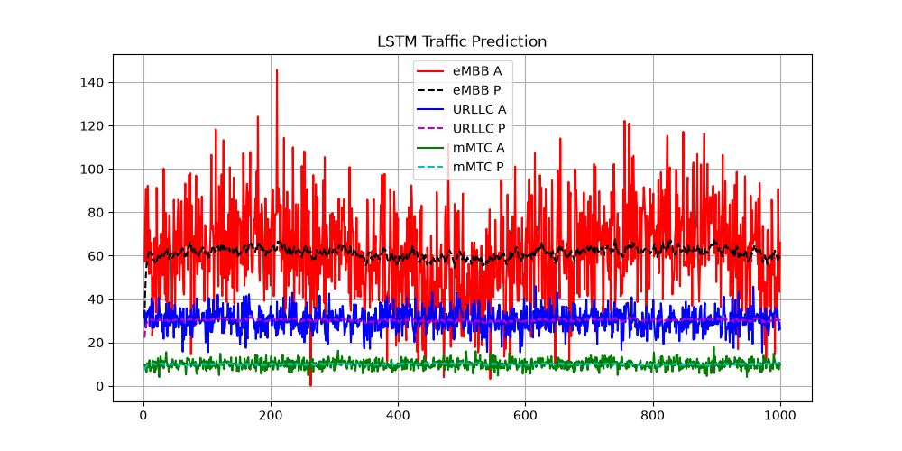
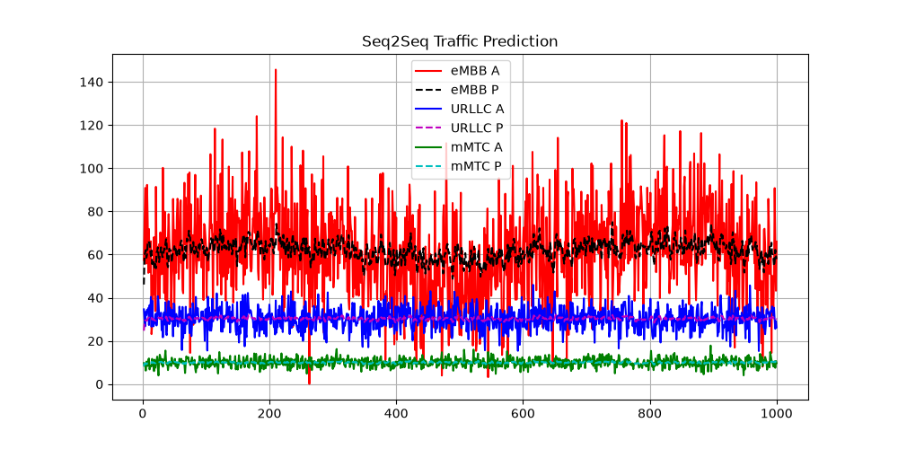
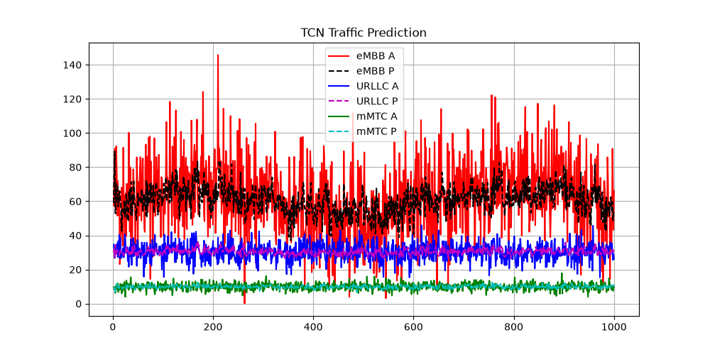
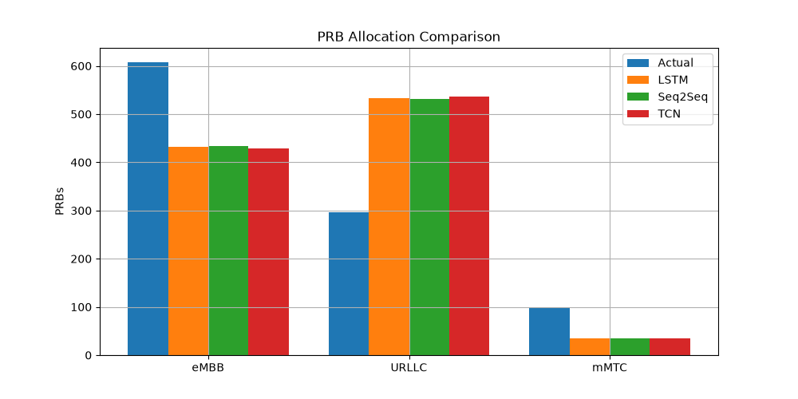
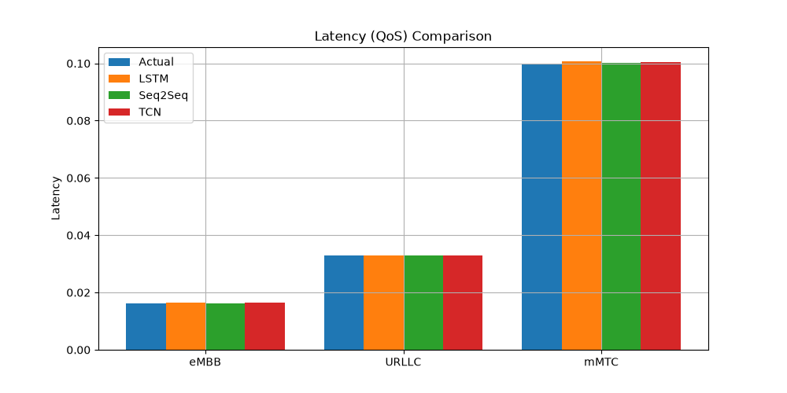

# 5G Network Slice Traffic Prediction & Resource Management

An intelligent framework for predicting 5G multi-slice network traffic requirements using Deep Learning architectures. This simulation models dynamic multi-queue traffic profiles across key telecom network configurations and contrasts multiple deep sequencing methodologies.

## 📊 5G Slice Traffic Profiles
The engine models three primary service configurations defined under 5G standard infrastructure networks:
* **eMBB (Enhanced Mobile Broadband):** High capacity streaming patterns governed by a steady baseline matrix with periodic seasonal fluctuations.
* **URLLC (Ultra-Reliable Low-Latency Communications):** High priority, bursty profiles with extreme sudden signal variances.
* **mMTC (Massive Machine Type Communications):** Low-bandwidth baseline streams with minimal random perturbations.

### Simulated Base Traffic


## 🤖 Deployed Architectures
The system evaluates sequence trends against three unique modern neural topologies:
1. **Long Short-Term Memory (LSTM):** Core recurrent model baseline processing trends via internal continuous memory gates.
2. **Sequence-to-Sequence (Seq2Seq):** Enhanced recurrent layer setup featuring 128 hidden storage configurations to model long-term trends.
3. **Temporal Convolutional Network (TCN):** Optimized parallel structural configuration utilizing deep causal padding layers to bypass recurrent gradient decay.

### Architecture Performance Visualizations
* **LSTM Model Tracking:**


* **Seq2Seq Model Tracking:**


* **TCN Model Tracking (Optimized):**


## 📈 System Metrics & Analysis
The framework calculates critical 5G operational metrics to ensure Quality of Service (QoS):
* **Root Mean Squared Error (RMSE):** Assesses exact spatial tracking accuracy of traffic profiles.
* **Throughput Optimization:** Computes data stream utilization profiles across each slice window.
* **PRB Allocation Matrix:** Dynamically shifts Physical Resource Blocks based on slice priorities and bandwidth constraints.
* **Latency Mitigation:** Inversely monitors delay trends across slices to guarantee optimal communication lines.

### Allocation and QoS Metrics Output
* **Physical Resource Block Matrix:**


* **Network Latency Assessment:**


## 🛠️ Project Execution Requirements
Run the following terminal command locally to guarantee your system holds compatible environment blocks:
```bash
pip install numpy matplotlib tensorflow
```

### Running the Simulator
To train the neural networks and render the visualization graphs, execute:
```bash
python networkslice.py
```
